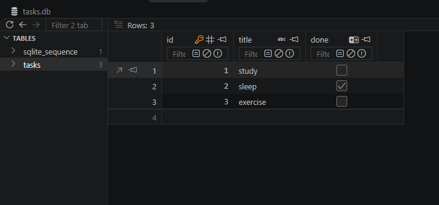

# Task Management API (SQLite Edition)

A lightweight, persistent RESTful Task API built with **FastAPI**, **Pydantic**, and **SQLite3**. It implements full CRUD operations, SQL-driven filtering and aggregation, idempotent database startup seeding, and interactive OpenAPI documentation.

---

## Why SQLite Was Chosen

- **Zero-Configuration & Serverless:** SQLite is an embedded database engine that runs in-process. It requires no standalone database server setup, daemon processes, or external services.
- **Single-File Portability:** The entire database resides in a single, local file (`tasks.db`), making it straightforward to inspect, back up, and clone across development environments.
- **Speed & Simplicity:** For small to medium local applications, reading and writing to an in-process SQLite file introduces virtually zero network latency while providing full ACID compliance.

---

## Database File Location & Behavior

- **Storage Path:** The database is saved directly at the root of the project directory as `tasks.db`.
- **Automatic Initialization:** When starting the API for the first time, the application's `lifespan` handler automatically triggers `init_db()`. If `tasks.db` is missing, SQLite creates the file, defines the `tasks` schema with `CREATE TABLE IF NOT EXISTS`, and seeds three default tasks (`study`, `sleep`, `exercise`).

---

## Getting Started

### Prerequisites

- Python 3.10+
- `uv` (recommended) or `pip`

### Installation & Run

1. **Clone the repository:**

   ```bash
   git clone <your-repo-url>
   cd <your-repo-folder>
   ```

2. **Run the server with `uv`** (automatic dependency resolution):

   ```bash
   uv run uvicorn main:app --reload
   ```

   *(Or install via standard `pip` and run):*

   ```bash
   pip install fastapi uvicorn pydantic
   uvicorn main:app --reload
   ```

3. **Verify the server is live:**

   The API will start at [http://127.0.0.1:8000](http://127.0.0.1:8000). The database file `tasks.db` will be created automatically in the root folder upon boot.

---

## Database Inspection & Manual Exploration

The database can be inspected using any viewer (e.g., DB Browser for SQLite or VS Code's SQLite Viewer).
## Database Inspection & Manual Exploration

The database can be inspected using any viewer (e.g., DB Browser for SQLite or VS Code's SQLite Viewer).



### Example SQL Query Executed

During manual testing in Stage 4, custom queries were run directly against `tasks.db`. For example, to retrieve only completed tasks:

```sql
SELECT id, title, done, created_at 
FROM tasks 
WHERE done = 1;
```

---

## API Endpoints

| Method | Endpoint      | Status Code                              | Description                                                                                   |
|--------|---------------|--------------------------------------------|-------------------------------------------------------------------------------------------------|
| GET    | `/`           | 200 OK                                     | Root endpoint returning API metadata and routes.                                               |
| GET    | `/tasks`      | 200 OK                                     | List all tasks. Supports SQL filtering (`?done=true`), search (`?search=keyword`), and sorting (`?sort=title`). |
| GET    | `/tasks/{id}` | 200 OK / 404 Not Found                     | Retrieve a single task by its integer ID.                                                      |
| POST   | `/tasks`      | 201 Created / 400 Bad Request              | Create a new task (body: `{"title": "..."}`).                                                  |
| PUT    | `/tasks/{id}` | 200 OK / 400 Bad Request / 404 Not Found   | Update title and/or done status via SQL `UPDATE`.                                              |
| DELETE | `/tasks/{id}` | 204 No Content / 404 Not Found             | Delete a task by ID via SQL `DELETE`.                                                          |
| GET    | `/stats`      | 200 OK                                     | Dynamic statistics calculated using SQL `COUNT` and `SUM`.                                     |

---

## Request & Response Examples

### 1. Read All Tasks (GET)

```bash
curl -i http://localhost:8000/tasks
```

```http
HTTP/1.1 200 OK
content-type: application/json

[
  {"id": 1, "title": "study", "done": false},
  {"id": 2, "title": "sleep", "done": true},
  {"id": 3, "title": "exercise", "done": false}
]
```

### 2. Create Task (POST)

```bash
curl -i -X POST http://localhost:8000/tasks \
  -H "Content-Type: application/json" \
  -d "{\"title\": \"Build database API\"}"
```

```http
HTTP/1.1 201 Created
content-type: application/json

{"id": 4, "title": "Build database API", "done": false}
```

### 3. Update Task (PUT)

```bash
curl -i -X PUT http://localhost:8000/tasks/4 \
  -H "Content-Type: application/json" \
  -d "{\"done\": true}"
```

```http
HTTP/1.1 200 OK
content-type: application/json

{"id": 4, "title": "Build database API", "done": true}
```

### 4. Delete Task (DELETE)

```bash
curl -i -X DELETE http://localhost:8000/tasks/4
```

```http
HTTP/1.1 204 No Content
```

### 5. Task Statistics (GET)

```bash
curl -i http://localhost:8000/stats
```

```http
HTTP/1.1 200 OK
content-type: application/json

{"total": 3, "done": 1, "open": 2}
```

---

## Data Persistence Verification

Unlike an in-memory collection where state is wiped upon process termination, all write operations (`INSERT`, `UPDATE`, `DELETE`) execute directly against disk-backed storage (`tasks.db`). When the server process is killed (`Ctrl + C`) and restarted, all newly created tasks and changes remain fully intact.
